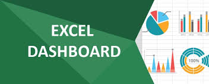

# Dashboard

    

<a href="Vendas_Dashoboard.xlsx" title="View Excel now"> 📕Clique aqui para conferir meu Dashboard </a>

 

# Projeto Dashboard realizado pelo Microsoft Excel

 > ℹ️ **NOTE:** Este é o repositório desenvolvido durante uma live no Youtube em parceria com a [DIO](https://dio.me)

Projeto com o objetivo de gerar um dashboard

## 💻 Ferramentas utilizadas no projeto

- Deezer: para ouvir música enquanto racho a cuca 
- Café: muito mesmo para me manter acordada
- Chocolate: para acalmar o coração
- Fé: nem preciso falar nada, né?

## ✨ Como foi feito ?

- Com Sangue
- Suor
- e Lágrimas

## 👨‍💻 Aprendiz

    
    
&nbsp&nbsp&nbsp Mary  
    &nbsp&nbsp&nbsp
    <a 
        href="https://github.com/maryinthebox">
        GitHub
  
    
  
   
  

---

⌨️ com 💜 por [Mary](https://github.com/maryinthebox)# podcast
IA tools to create a podcast
